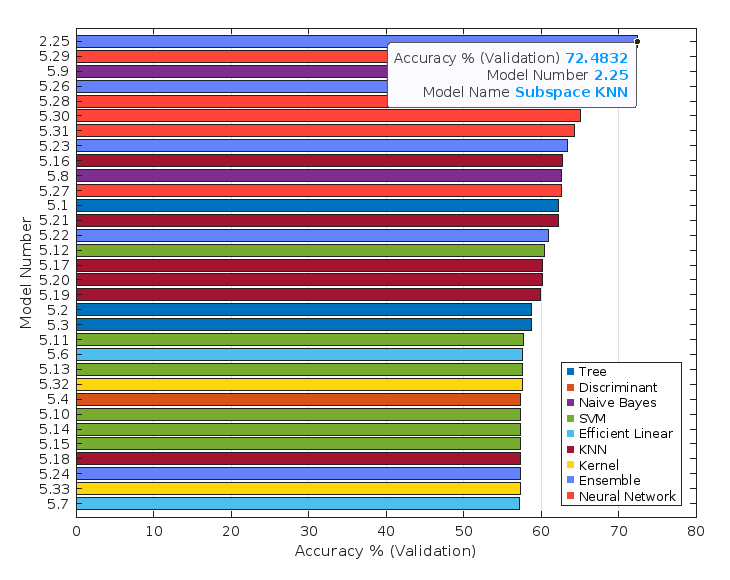
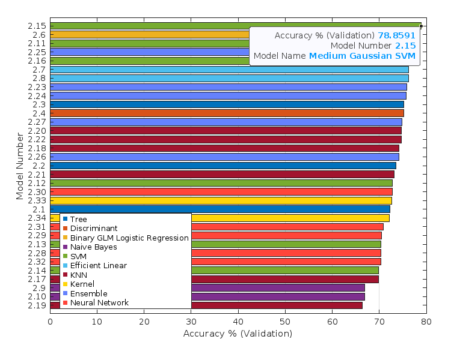

# 🎓 Machine Learning Predictive Models of Engineering Student Attrition
This repository contains the core Machine Learning classification models developed for the early detection of engineering student at-risk of attrition. 
This research was presented at the **World Engineering Education Forum (WEEF-GEDC 2025)** in South Korea and is officially indexed in the **IEEE Xplore Digital Library**.
For full technical details, theoretical background, and extended results, please refer to the official paper:
> **Esparza-Posadas, M.F., Ávila-Esquivel, N. and Valdez-Sánchez, J.I.** "Early Predictive Modeling of Engineering Student Attrition: An AI-Driven Machine Learning Approach," in *WEEF-GEDC 2025, World Engineering Education Forum - Global Engineering Deans Council, Proceedings*, 2025, pp. 1-9, <https://doi.org/10.1109/WEEF-GEDC66748.2025.11256450>

## 🧠 Predictive Models
The repository includes MATLAB functions representing two distinct stages of the academic diagnostic process:
* **Model A) Ensemble Subspace KNN (Second Semester Data):** Utilizes 14 academic variables. This model is designed for early intervention after the first year of the engineering program.
📂 [View Source Code (train_classifier_2sem.m)](src/train_classifier_2sem.m)
* **Model B) Medium Gaussian SVM (Third Semester Data):** Incorporates a broader set of 21 variables, offering a robust longitudinal diagnostic of student retention.
📂 [View Source Code (train_classifier_3sem.m)](src/train_classifier_3sem.m)

The scope of this research is intentionally focused on the first three semesters, as institutional data from the National Autonomous University of Mexico (UNAM) shows that the majority of student attrition occurs during this early period. Consequently, developing models for later stages (while potentially more accurate due to more data) would lack practical utility for timely academic intervention.

## 🛠️ Feature Engineering & Data Preparation
To enhance the predictive power of the models, a specialized encoding process was applied to the raw academic records:
* **Academic Progression Encoding:** Academic features were engineered to represent the *type* of exam attempts (standard vs. remedial) and the specific attempt number in which a course was successfully passed.
* **Normalization Testing:** Standard data normalization was evaluated across all datasets.
* **Feature Selection:** Contextual variables such as assigned group, academic shift (morning/afternoon), and inter-subject correlations were explored.

## 🧪 Methodology & Experimental Setup
To ensure the reliability and generalizability of the results, the following experimental protocol was implemented:
* **Data Partitioning:** A 90/10 split was used, reserving 10% of the data for final independent testing.
* **Cross-Validation:** 5-fold Cross-Validation was applied during the training phase to evaluate model stability and prevent overfitting.
* **Cost-Sensitive Learning:** A custom Cost Matrix `[0, 5; 1, 0]` was integrated to penalize False Negatives (failing to identify a student at risk) five times more than False Positives. This reflects the ethical priority of maximizing student support over avoiding false alarms.

## 📈 Performance & Results
The model selection process involved benchmarking over 30 different architectures. The **Subspace KNN Ensemble (Second Semester Data)** and **Medium Gaussian SVM (Third Semester Data)** emerged as the top performers. The following figures illustrate the performance comparison across different machine learning architectures for both stages.

### Stage 1: Second Semester Data
This stage utilizes a **baseline set of 14 variables**. While the data features are more focused at this point, this phase represents the most critical window for early institutional intervention and student support.

#### Figure 1: Accuracy comparison for 2nd-semester Machine Learning models. 

*Source: [Esparza-Posadas, et al. (2025)](https://doi.org/10.1109/WEEF-GEDC66748.2025.11256450)*

### Stage 2: Third Semester Data
By incorporating a total of **21 variables**, including cumulative academic performance, the models achieve higher predictive accuracy.

#### Figure 2: Accuracy comparison for 3rd-semester Machine Learning models.

*Source: [Esparza-Posadas, et al. (2025)](https://doi.org/10.1109/WEEF-GEDC66748.2025.11256450)*

## 🚀 Future Work & Limitations
While the current models provide a robust baseline, several avenues for improvement have been identified to enhance predictive power:
* **Multidimensional Integration:** Incorporating socio-economic factors, psychological metrics, and student engagement data for a holistic view of attrition risk.
* **Imbalance Mitigation:** Further refining classification costs to handle the inherent class imbalance between graduates and attrition cases.
* **Feature Engineering:** Exploring subject correlations and the potential influence of the dynamics between instructors and students on retention.
* **Dataset Expansion:** Validating results with more recent cohorts to adapt to currently academic trends.

## 📁 Repository Structure
* `/src`: Contains the `.m` files with the core logic for the classifiers.
* `/img`: Performance comparison graphics exported from the study.
* `README.md`: Project documentation.
* `LICENSE`: GNU General Public License v3.0.

## 📜 License
This project is licensed under the **GNU General Public License v3.0**. This ensures that the research remains open and accessible for the scientific community, while protecting the author's intellectual property rights regarding commercial applications. 
See the [LICENSE](LICENSE) file for full details.
